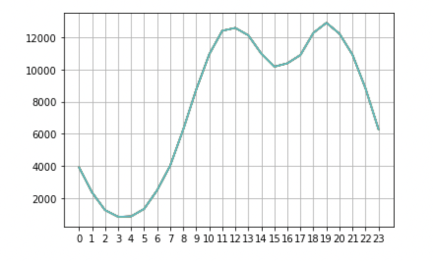
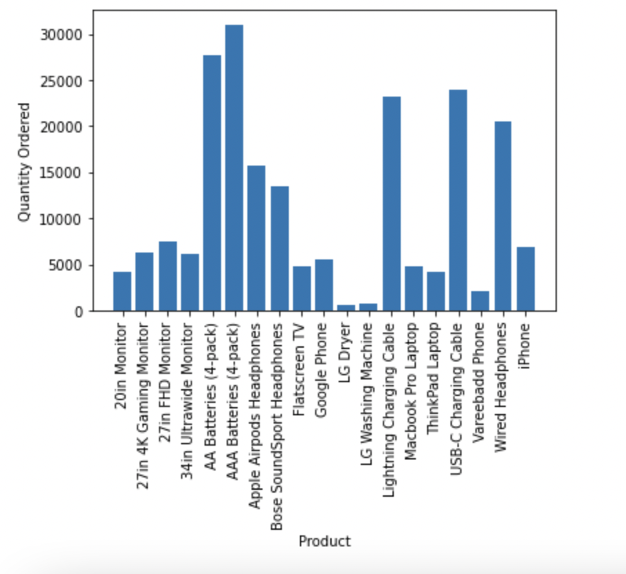
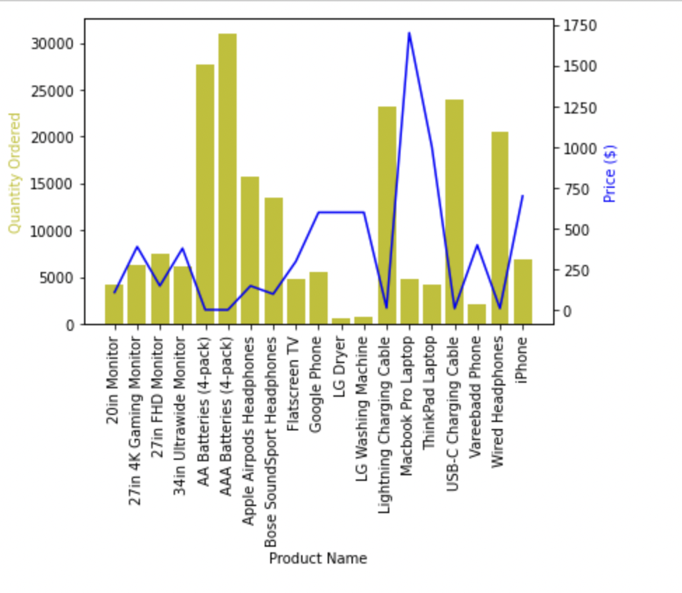

# Sale Analysis Report and Visualization

This repo is about analysing some sales data and assessing:
 - **Best Selling month? Revenue?**
 - **Best Selling City?**
 - **Times To Display Ads For Customer Purchase Maximization**
 - **Products Most Often Sold Together**
 - **Most Sold Product**

 I generated some random sales data using libraries like Numpy and Random on VS Code.
Then, using Jupyter lab I was able to clean and organize the data using the pandas library to concatenate all the monthly data into one large CSV file containing all the data.

First, I wanted to see what was the best selling month. So I had to clean the data dropping the nan values and then convert the columns to strings to be able to perform multiplication between the Price and Quantity columns. 

Second, I wanted to see which city sold the most in usd. So I created a "City" column, then used the ``groupby`` function to add up all the sales by city.

Third, I wanted to see what would be the best time to display ads based on the most common times products were being purchased.
For that I created new columns for hours and minutes, then I used the ``groupby`` function again to what were the most common hours for purchases.

Forth, I wanted to find out what items were most often sold together. I imported the Collections library so I could used the ``Counter`` function, then I created a new dataframe containing all the order ids, and created a new column to group the items being bought together with the same order id number. 

Lastly, I wanted to know which item sold the most. I grouped the items by product and them added up the quantity ordered.  

 - **Best Selling month?**
    - December

 - **Best Selling City?**
   - San Francisco
 - **Times To Display Ads For Customer Purchase Maximization**
   - Around 12:00pm and 7:00pm

  - **Products Most Often Sold Together**
    - iPhone, Lightning Charging Cable, 1005
    - Google Phone, USB-C Charging Cable, 987
    - iPhone, Wired Headphones, 447

  - **Most Sold Product**
    - AAA Bateries
    - AA Bateries
    - USB-C Charging Cable
